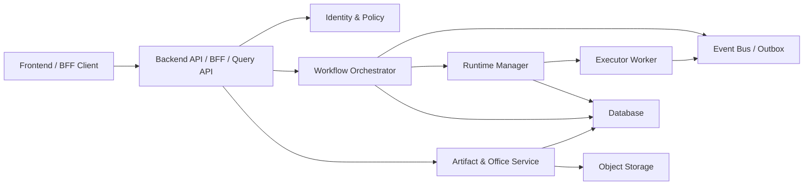

# Poco 最终整洁架构目标

本文档定义 Poco 的长期架构北极星。它不描述当前最小成本方案，而描述在不优先考虑工作量、迁移成本和短期妥协时，Poco 应该收敛到的最终形态。

当后续用户只说“继续”，且没有新的、更具体指令时，AI 代理应默认把当前工作推进到本文档定义的最终版本：先选择下一处最能减少架构债的边界，再用小步、可验证、可回滚的改动向该目标演进。

本文档是产品架构准绳；仓库治理、分支、发布、CI/CD 和自动化规则仍以 [repository-governance.md](repository-governance.md) 为准。

## 1. 最终定位

Poco 的最终形态是一个事件驱动、多租户的 Agent 执行控制平面。

它的核心责任不是“把几个 HTTP 服务串起来”，而是可靠地管理用户意图、运行状态、沙箱资源、执行事件、产物版本和人工交互，使 Claude Agent SDK、OnlyOffice、Docker/Kubernetes、对象存储、数据库、消息队列等外部技术都成为可替换适配器。

最终系统应满足：

- 用户身份、租户边界、权限策略和审计链路是系统级能力，不依赖任意客户端传入的头。
- Run / Session / Artifact / EditSession 都有明确状态机、所有权和幂等规则。
- 运行调度由持久化工作流驱动，而不是由内存轮询和临时 HTTP 串联决定。
- 容器或 Pod 生命周期由 Runtime Manager 管理，Executor Worker 只负责在沙箱里执行任务。
- Office 编辑、文件写回和产物版本属于独立有界上下文，不散落在路由处理器里。
- 所有外部系统只通过端口进入用例层；框架、SDK、数据库、存储、HTTP 客户端不能泄漏到领域模型。
- Agent 的说明、工具、技能、运行时、连接、渠道和计划任务应被建模为可版本化的产品契约，而不是散落的运行时配置字典。

## 2. 不可谈判原则

### 2.1 依赖方向只向内

领域模型和用例层不得依赖 FastAPI、SQLAlchemy、Docker SDK、httpx、S3/R2、OnlyOffice、Claude Agent SDK、APScheduler 或前端框架。

允许依赖方向：

```text
Frameworks / Drivers
    -> Interface Adapters
    -> Application Use Cases
    -> Domain Model
```

禁止反向依赖。任何“为了方便”从用例里直接创建 HTTP 客户端、Docker client、数据库 session、对象存储 client 的改动，都应被视为架构债。

### 2.2 用例表达业务，而不是编排技术细节

用例层可以表达：

- claim run
- start run
- dispatch run
- complete run
- fail run
- request office save
- commit office save
- publish artifact version
- allocate runtime
- expire lease
- request human input

用例层不应直接表达：

- 构造某个 HTTP header
- 拼接某个服务 URL
- 选择 Docker API 调用细节
- 读写对象存储 key 的具体格式
- 解析 OnlyOffice callback 原始结构
- 创建 FastAPI `HTTPException`

这些都属于适配器或接口转换层。

### 2.3 状态变化必须可审计、可重放、可补偿

核心状态变化必须满足：

- 有明确命令来源和操作者身份。
- 有幂等键或事件 ID。
- 有前置状态校验。
- 有持久化事件或 outbox 记录。
- 失败后能重试、补偿或进入明确的失败状态。

不能把“执行成功”建立在多个外部副作用都刚好成功的假设上。

### 2.4 安全边界先于功能便利

控制面接口默认不公开。任何能改变 run、session、container、workspace、artifact、edit session 或 executor 状态的接口，都必须有服务身份、用户身份、租户边界和授权策略。

禁止把以下内容作为可信身份来源：

- 客户端可直接伪造的用户 ID header
- 可猜测的 session ID
- 仅靠内网部署假设保护的控制接口
- 没有签名或 token 的回调

### 2.5 文件与产物写入必须事务化建模

对象存储、workspace 文件、manifest、数据库状态和前端可见状态必须通过一个明确的提交协议保持一致。

最终规则：

- 先把外部内容写入 staging。
- 校验大小、类型、hash、版本和所有权。
- 在数据库事务中提交 manifest / version / save status。
- 提交成功后再发布可见版本。
- 失败时保留旧版本，并把失败原因写入状态机。

## 3. 目标服务边界

最终服务边界如下：



### 3.1 Backend API / BFF / Query API

Backend 最终只承担：

- 用户认证后的 API 入口。
- BFF 聚合和查询模型读取。
- 命令入口：把用户意图转成应用命令。
- 权限校验入口：用户、租户、项目、会话、文件所有权。

Backend 不应长期承担：

- 运行调度细节。
- 容器生命周期细节。
- Executor 调用细节。
- Office 写回提交细节。
- 对外部回调原始协议的业务解释。

### 3.2 Workflow Orchestrator

Workflow Orchestrator 是 run/session 的事实来源，负责：

- durable queue
- run lease
- retry policy
- timeout policy
- idempotency
- compensation
- run/session 状态机
- event outbox

它通过端口调用 Runtime Manager、Artifact Service、通知服务和查询模型更新器。

### 3.3 Runtime Manager

Runtime Manager 只负责运行时资源：

- 容器或 Pod 分配。
- sandbox 生命周期。
- workspace mount 策略。
- executor endpoint 发现。
- 健康检查。
- 资源限制。
- 运行结束后的清理。

它不解释用户业务语义，不决定 run 是否完成，也不直接写用户可见产物状态。

### 3.4 Executor Worker

Executor Worker 是受控沙箱内的执行器，最终只负责：

- 接收已授权、已签名、已分配的 task lease。
- 准备本地执行环境。
- 调用 Claude Agent SDK。
- 执行 hook。
- 向事件端口发送进度、消息、工具调用、产物候选和终止事件。

Executor Worker 不拥有调度权，不拥有最终 run 状态，不直接信任外部调用方。

### 3.5 Artifact & Office Service

Artifact & Office Service 是文件、产物和 Office 编辑的有界上下文，负责：

- logical artifact
- artifact version
- workspace manifest
- Office edit session
- Office save request
- staged writeback
- download latest
- save conflict
- format capability
- file ownership

OnlyOffice 是外部协作编辑适配器，不是领域模型。

## 4. 目标领域模型

### 4.1 核心聚合

最终领域至少包含这些聚合：

- `Tenant`
- `User`
- `Project`
- `AgentSession`
- `Run`
- `RunLease`
- `RuntimeAllocation`
- `WorkspaceSnapshot`
- `Artifact`
- `ArtifactVersion`
- `OfficeEditSession`
- `OfficeSaveRequest`
- `HumanInputRequest`
- `PolicyDecision`
- `DomainEvent`
- `AgentBundle`
- `ToolDefinition`
- `SkillDefinition`
- `Connection`
- `ChannelBinding`
- `ScheduleDefinition`
- `EvaluationSuite`

聚合之间通过 ID 和领域事件协作，不通过 ORM 对象互相穿透。

### 4.2 Agent Bundle 与运行清单

Agent 最终应有一个可版本化、可审计、可测试的运行清单。它不是前端表单拼出的松散 `dict`，而是一个明确的领域对象，例如 `AgentBundle` 或 `RunBundle`。

该清单至少应表达：

- `instructions`：Agent 的身份、边界、行为准则和长期记忆入口。
- `tools`：可调用工具及其权限、输入输出 schema、确认策略和连接依赖。
- `skills`：可按需加载的操作手册、领域 playbook 或上下文包。
- `runtime`：沙箱 profile、资源限制、工作区挂载策略和网络策略。
- `connections`：GitHub、对象存储、Office、消息渠道等外部系统授权引用。
- `channels`：Web、API、Webhook、ChatOps 或其他入口渠道。
- `schedules`：定时、窗口、重试和补偿触发规则。
- `evaluations`：用于发布、回归和持续监控的评测集。

运行时用例只接收已经校验过的清单快照。外部协议、UI 表单结构、HTTP payload、SDK 配置格式和第三方凭证细节只能存在于适配器或专门的配置转换器中。

### 4.3 Run 状态机

Run 最终应有显式状态机：

```text
queued
  -> leased
  -> staging
  -> runtime_allocated
  -> sent_to_executor
  -> running
  -> completing
  -> completed

queued / leased / staging / runtime_allocated / sent_to_executor / running
  -> failing
  -> failed

leased / staging / runtime_allocated / sent_to_executor / running
  -> lease_expired
  -> queued
```

每次状态迁移都必须校验：

- 当前状态是否允许迁移。
- 操作者服务身份是否允许迁移。
- lease 是否仍有效。
- 幂等键是否已处理。
- 是否需要发布领域事件。

### 4.4 Office Save 状态机

Office Save 最终应有显式状态机：

```text
requested
  -> force_save_sent
  -> callback_received
  -> staged
  -> committed
  -> visible

requested / force_save_sent / callback_received / staged
  -> failed

requested / force_save_sent
  -> expired
```

写回成功的定义不是“收到 OnlyOffice callback”，而是：

1. callback 已验证。
2. 内容已下载到 staging。
3. 所有权和版本仍匹配。
4. manifest / artifact version / save request 状态已在事务中提交。
5. 最新可见版本已切换。

## 5. 端口与适配器

### 5.1 应用端口

最终应围绕用例定义端口，例如：

- `IdentityProvider`
- `PolicyEngine`
- `RunRepository`
- `RunLeaseRepository`
- `WorkflowEventPublisher`
- `RuntimeAllocator`
- `ExecutorGateway`
- `ObjectStore`
- `WorkspaceManifestStore`
- `ArtifactRepository`
- `OfficeDocumentGateway`
- `Clock`
- `IdGenerator`
- `AgentBundleRepository`
- `ConnectionProvider`
- `ChannelGateway`
- `ScheduleRepository`
- `EvaluationRunner`

用例只依赖这些端口。适配器负责把端口映射到 FastAPI、SQLAlchemy、httpx、Docker、S3/R2、OnlyOffice、Claude SDK 或消息队列。

### 5.2 适配器规则

适配器可以知道外部协议细节，但不能泄漏到领域层。

例如：

- FastAPI adapter 把 HTTP request 转为 command。
- SQLAlchemy adapter 实现 repository。
- httpx adapter 实现 service gateway。
- Docker/Kubernetes adapter 实现 runtime allocator。
- OnlyOffice adapter 把 callback 转为 `OfficeSaveCallbackReceived`。
- Claude SDK adapter 把 SDK message 转为 executor event。

### 5.3 连接、渠道和计划任务

外部连接、入口渠道和计划任务必须是一等端口，而不是工具实现里的隐式配置。

- `Connection` 只暴露授权引用和能力，不把长期密钥泄漏给用例或 Executor Worker。
- Worker 拿到的是短期、可撤销、可审计的授权材料，例如 signed lease、scoped token 或 credential handle。
- `ChannelBinding` 把 Slack、Webhook、Web UI、API、Cron 等入口转换为统一应用命令，不让渠道协议进入 Workflow Orchestrator。
- `ScheduleDefinition` 描述计划、窗口和重试策略；调度器适配器负责映射到 APScheduler、队列、cron 或工作流引擎。
- 工具调用需要人工确认时，必须进入显式 approval / human-input 状态，而不是阻塞在某个 HTTP 请求或内存任务里。

### 5.4 评测与发布门禁

Agent Bundle、工具、技能和调度策略都应能绑定评测集。

- 新 bundle 版本发布前应运行对应 `EvaluationSuite`。
- 关键工具和高风险能力必须有回归样例，覆盖权限、确认、失败补偿和输出约束。
- 生产运行事件可以回流为评测样例，但必须经过脱敏和所有权校验。
- CI 只能证明代码质量；评测门禁负责证明 Agent 行为是否仍满足产品契约。

## 6. 事件与 outbox

最终所有跨服务业务流都应通过事件或持久化 outbox 连接。

核心事件包括：

- `AgentBundlePublished`
- `AgentBundleEvaluationPassed`
- `ConnectionAuthorized`
- `ConnectionRevoked`
- `ChannelCommandReceived`
- `ScheduleTriggered`
- `RunQueued`
- `RunLeased`
- `RunDispatchStarted`
- `RuntimeAllocated`
- `ExecutorTaskAccepted`
- `ExecutorProgressReported`
- `ExecutorToolCallRecorded`
- `RunCompletionRequested`
- `RunCompleted`
- `RunFailed`
- `ArtifactVersionDetected`
- `OfficeSaveRequested`
- `OfficeSaveCommitted`
- `OfficeSaveFailed`
- `HumanInputRequested`
- `HumanInputResolved`
- `HumanApprovalRequired`
- `HumanApprovalResolved`

HTTP 可以作为同步命令入口，但不能作为唯一事实来源。跨服务状态推进必须能从数据库事件或 outbox 中恢复。

## 7. 五个已知问题映射到最终架构

### 7.1 不可信用户身份 header

最终修复方向：

- 用户身份由认证系统或可信网关产生。
- 应用命令携带 `Actor`，其中包含 user、tenant、roles、scopes 和认证来源。
- 所有 ownership check 使用 `Actor` 和策略端口，不读取任意 `X-User-Id` 作为事实。

### 7.2 run queue 控制面公开

最终修复方向：

- run claim/start/fail 只能由 Workflow Orchestrator 或授权 worker lease 调用。
- 所有状态迁移必须验证 service identity、lease token、状态前置条件和幂等键。
- 外部 HTTP 不能直接控制调度状态。

### 7.3 executor 入口未认证

最终修复方向：

- Executor Worker 只接受 Runtime Manager 下发的短期 signed task lease。
- task lease 签名密钥独立于 callback bearer token，允许按边界单独轮换。
- lease 绑定 run、session、tenant、executor instance、过期时间和权限范围。
- Executor 端口即使暴露到 host，也不能被未授权调用方触发执行。

### 7.4 Office 写回非原子

最终修复方向：

- Office writeback 是 Artifact & Office Service 的用例。
- callback 下载、staging 写入、hash 校验、manifest 更新、version 发布和 save 状态推进必须按提交协议执行。
- 用户可见“保存成功”只能在 committed / visible 后返回。

### 7.5 Dispatch use case 混入适配器

最终修复方向：

- Dispatch 用例只表达业务步骤和状态迁移。
- backend HTTP、executor HTTP、container pool、config resolver、workspace stager 全部变成端口实现。
- 失败清理由补偿动作或 workflow policy 管理，而不是散在一个服务方法里的 `try/except`。

## 8. 后续“继续”的默认执行协议

当用户只说“继续”时，AI 代理应按以下规则执行：

1. 先读取当前 git 状态、最新提交、相关文档和目标模块，确认真实上下文。
2. 如果当前线程已有未完成任务，继续该任务；否则从本文档选择下一处最高价值架构债。
3. 优先处理会破坏安全边界、状态一致性或核心依赖方向的问题。
4. 每次只推进一个清晰边界：身份、run workflow、executor lease、office artifact、runtime allocation、事件 outbox 或适配器抽离。
5. 每次改动必须包含对应测试或至少可执行验证。
6. 不把临时 plan、调查记录、node_modules、本地 agent 配置带入提交。
7. 不为了“完美架构”一次性大爆炸重写；最终目标可以宏大，落地动作必须可审计。

默认优先级：

1. 身份与服务间认证统一。
2. run workflow 状态机和 lease 模型。
3. executor signed task lease。
4. Office / artifact 版本化写回。
5. Runtime Manager 端口化。
6. Agent Bundle / Run Bundle 清单化和版本化。
7. Connection / Channel / Schedule 端口化。
8. Executor Manager 调度用例拆分。
9. event outbox 和查询模型分离。
10. 前端按 BFF/query contract 收敛。

## 9. 迁移守则

未来任何架构推进都必须遵守：

- 先把当前行为用测试钉住，再移动边界。
- 新旧路径并存时，明确兼容期和删除条件。
- 每次抽端口只抽当前用例实际需要的能力。
- 适配器可以脏，但用例和领域模型必须干净。
- 数据迁移必须可回滚或可重复执行。
- 外部协议变更必须有版本或能力探测。
- 安全边界不能等待最后统一补。
- 文档和代码边界同时更新。

## 10. 完成标准

Poco 可以被认为接近本文档定义的最终架构，当且仅当：

- 领域模型不依赖框架和外部 SDK。
- 核心用例可在无 FastAPI、无 Docker、无真实对象存储、无 Claude SDK 的测试中运行。
- 所有控制面接口都有明确服务身份、用户身份、租户边界和授权策略。
- run/session/office/artifact 状态机可追踪、可审计、可恢复。
- Agent Bundle / Run Bundle 是可版本化、可评测、可审计的领域契约，而不是散装配置字典。
- 连接、渠道、计划任务和人工确认都通过端口和显式状态进入系统。
- 跨服务副作用通过事件或 outbox 保证最终一致。
- Runtime Manager、Executor Worker、Artifact & Office Service 的职责边界稳定。
- 新功能默认通过端口加入，而不是把外部 client 塞进用例。

这个目标优先于短期代码便利。只要用户没有给出相反指令，“继续”就表示继续向这个最终架构收敛。
